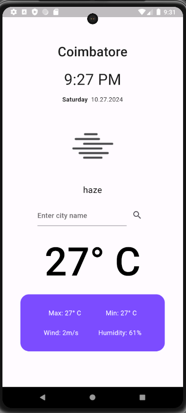
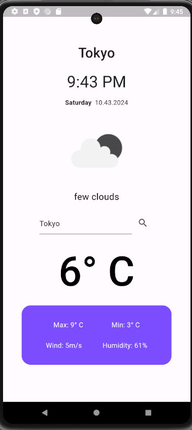

# Flutter Weather App

A simple weather app built with Flutter that fetches weather data from the OpenWeatherMap API and displays it to the user.

## Features

- View current weather information based on the manually entered city name.
- Display temperature, weather condition, wind speed, humidity, and more.
- Supports dynamic updates when the user switches between different cities.
- Clean and intuitive user interface.

## Screenshots

